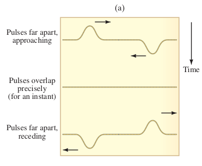

# Shockley Homework: Chapter 11

##  **#1** – Pg. 323-4 # 5, 9, 15, 25, 28, 30

### 5

> A fisherman’s scale stretches 3.6 cm when a 2.4-kg fish hangs from it. (a) What is the spring stiffness constant and (b) what will be the amplitude and frequency of oscillation if the fish is pulled down 2.1 cm more and released so that it oscillates up and down?

$$
F = -kx \Longrightarrow mg = -kx \Longrightarrow k = -\dfrac{mg}{x} = \dfrac{2.4\;\mathrm{kg}\cdot 9.8\;\mathrm{m/s^2}}{0.036\;\mathrm{m}} \approx \boxed{653\;\mathrm{N/m}}
$$

### 9

> The figure shows two examples of SHM, labeled A and B. For each, what is (a) the amplitude, (b) the frequency, and (c) the period?
>
>  
>
> 
>
> 

#### Graph A

**Amplitude:** 2.5 meters
**Frequency:** 0.25 Hz
**Period:** 4.0 seconds

#### Graph B

**Amplitude:** 2.5 meters
**Frequency:** 0.5 Hz
**Period:** 2.0 seconds

### 15

> A 0.25-kg mass at the end of a spring oscillates 2.2 times per second with an amplitude of 0.15 m. Determine (a) the speed when it passes the equilibrium point, (b) the speed when it is 0.10 m from equilibrium, (c) the total energy of the system, and (d) the equation describing the motion of the mass, assuming that at x was a maximum.

#### Part A

$$
v_{max} = A\sqrt{\dfrac{k}m} = \omega A = 2\pi fA = \boxed{2.1\;\mathrm{m/s}}
$$

#### Part B

$$
v = v_{max}\sqrt{1 - \dfrac{x^2}{A^2}} = \boxed{1.55\;\mathrm{m/s}}
$$

#### Part C

$$
E_{T} = \dfrac12 mv^2_{max} = \boxed{0.537\;\mathrm{J}}
$$

#### Part D

$$
x = 0.15\cos\left(2\pi (2.2)t\right) \Longrightarrow \boxed{x = 0.15\cos (4.4\pi t)}
$$

### 25

> A 1.60-kg object oscillates at the end of a vertically hanging light spring once every 0.45 s. (a) Write down the equation giving its position as a function of time Assume the object started by being compressed 16 cm from the equilibrium position (where ), and released. (b) How long will it take to get to the equilibrium position for the first time? (c) What will be its maximum speed? (d) What will be the object’s maximum acceleration, and where will it first be attained?

#### Part A

$$
A = 0.16\;\mathrm{m}\;\;\;//\;\;\; \omega = \dfrac{2\pi}{T} = 14.0\;\mathrm{rad/s} \Longrightarrow \boxed{y = 0.16\cos (14t)}
$$

#### Part B

The time to reach equilibrium = 1/4 of the period so $T_{eq} = 0.45/4 = \boxed{0.11\;\mathrm{s}}$

#### Part C

$$
v_{max} = A\sqrt{\dfrac{k}m} = \omega A = 0.16\cdot 2\pi\cdot \dfrac{1}{0.45} = \boxed{2.23\;\mathrm{m/s}}
$$

#### Part D

$$
a = \dfrac{kA}{m} = \omega^2 A = \boxed{31\;\mathrm{m/s^2}}
$$

### 28

> How long must a simple pendulum be if it is to make exactly one swing per second? (That is, one complete oscillation takes exactly 2.0 s.)

$$
T = 2\pi\sqrt{\dfrac{\ell}{g}} \Longrightarrow \ell = g\left(\dfrac{T}{2\pi}\right)^2 = \boxed{0.99\;\mathrm{m}}
$$

### 30

> What is the period of a simple pendulum 47 cm long (a) on the Earth, and (b) when it is in a freely falling elevator?

#### Part A

$$
T = 2\pi\sqrt{\dfrac{\ell}{g}} = \boxed{1.4\;\mathrm{s}}
$$

#### Part B

If the pendulum is in free fall, there is no tension in the string supporting the pendulum bob and no restoring force to cause oscillations as the force of gravity is not felt without the normal force. Hence, the “virtual” gravitational constant is 0, which when taken as a limit shows no bound and goes to $+\infty$. Hence, there is **no period**.

------

------

## **#2** – Pg. 324 # 35, 38, 39, 45, 48, 50, 54, 59, 61

### 35

> A fisherman notices that wave crests pass the bow of his anchored boat every 3.0 s. He measures the distance between two crests to be 7.0 m. How fast are the waves traveling?

$T = 3.0\;s$ and $\lambda = 7.0\;m$, so $f = \dfrac{1}{T}  =\dfrac{1}{3.0} = 0.33\;/s$ and $v = \lambda f = 7.0\cdot 0.33 = \boxed{\dfrac73\;\mathrm{m/s}}$

### 38

> AM radio signals have frequencies between 550 kHz and 1600 kHz (kilohertz) and travel with a speed of $3.0 \times 10^8\;\mathrm{m/s}$. What are the wavelengths of these signals? On FM the frequencies range from 88 MHz to 108 MHz (megahertz) and travel at the same speed. What are their
> wavelengths?

$$
c = \lambda f \Longrightarrow \lambda_{AM} = \dfrac{c}{f} \Rightarrow \dfrac{3.0\times 10^8}{1600\times 10^3 \;\;/\;\;550\times10^3} = \boxed{187.5\;\mathrm{m} - 545.5\;\mathrm{m}} 
$$

$$
\lambda_{BC} = \dfrac{3.0\times10^8}{108\times 10^6\;\;/\;\; 88\times 10^6} = \boxed{2.78\;\mathrm{m}-3.41\;\mathrm{m}}
$$

### 39

> P and S waves from an earthquake travel at different speeds, and this difference helps locate the earthquake “epicenter” (where the disturbance took place). (a) Assuming typical speeds of 8.5 km/s and 5.5 km/s for P and S waves, respectively, how far away did an earthquake occur if a particular seismic station detects the arrival of these two types of waves 1.5 min apart? (b) Is one seismic station sufficient to determine the position of the epicenter? Explain.

#### Part A

1.5 minutes = 90 seconds
$$
v_1(t_2 + 90) = v_2(t_2) \Longrightarrow t_2 = \dfrac{v_1}{v_2 - v_1} (90) = 165\;\mathrm{s}
$$

$$
v_2 t_2 = \Delta x = 165 \times 8.5 \approx \boxed{1400\;\mathrm{m}}
$$

#### Part B

With only one station, it is not possible to determine the position of the epicenter as when a station receives the waves, all points in a circle with the radius determined in the previous part. In reality, to triangulate the epicenter of an earthquake, we would need 3 stations.

### 45

> The intensity of an earthquake wave passing through the Earth is measured to be $3.0 \cdot 10^6 \;\mathrm{J/m^2\cdot s}$ at a distance of 54 km from the source. (a) What was its intensity when
> it passed a point only 1.0 km from the source? (b) At what rate did energy pass through an area of 2.0 m 2 at 1.0 km?

#### Part A

$$
I_{far}\left(\dfrac{r_{far}^2}{r_{near}^2}\right) = 3.0\times10^6\times54^2 = \boxed{8.75\times10^9\;\mathrm{W/m^2}}
$$

#### Part B

$$
P = IA = 8.75\times2\times 10^9 = \boxed{1.75\times10^{10}\;\mathrm{W}}
$$

### 48

> The two pulses shown in Fig. 11-54 are moving toward each other. (a) Sketch the shape of the string at the moment they directly overlap. (b) Sketch the shape of the string a few moments later. (c) In the second image, at the moment the pulses pass each other, the string is straight. What has happened to the energy at this moment?
>
>  

#### Part A

 $\boxed{\text{See sketch to the right.}}$ It is very rough as it was created  via Geogebra.

#### Part B

Similar to above but $\boxed{\text{the dip is to the right and the left side is higher than the right side}}$.

#### Part C

The energy is all $\boxed{\text{kinetic energy}}$ at the moment as there is no elastic potential energy in the rope as it has no displacement. Hence each piece of the rope has a speed but no displacement.

### 50

> A violin string vibrates at 294 Hz when unfingered. At what frequency will it vibrate if it is fingered one-third of the way down from the end? (That is, only two-thirds of the string vibrates as a standing wave.)

Since $f = \dfrac{c}{\lambda}$, the frequency will be multiplied by $\dfrac{1}{\left(\dfrac23\right)} = \dfrac32$. Therefore, the frequency is $\boxed{441\;\mathrm{Hz}.}$

### 54

> A guitar string is 92 cm long and has a mass of 3.4 g. The distance from the bridge to the support post is l = 62 cm, and the string is under a tension of 520 N. What are the frequencies of the fundamental and first two overtones?

Since we know that $\nu = \sqrt{\dfrac{F_T}{\mu}}$and $f_n = \dfrac{n\nu}{2\ell_{\text{vib}}}$, so combining them:
$$
f_n = \dfrac{n}{2\ell_{\text{vib}}}\sqrt{\dfrac{F_T}{\mu}} = \dfrac{n}{2\ell_{\text{vib}}}\sqrt{\dfrac{F_T}{\left(\dfrac{m}{\ell}\right)}}
$$
Since we are looking for the first fundamental, we get”
$$
f_1 = \dfrac{1}{2(0.62\;\mathrm{m})}\sqrt{\dfrac{520\;\mathrm{N}}{\left(\dfrac{3.4\times 10^{-3}\;\mathrm{kg}}{0.92\;\mathrm{m}}\right)}} = 302.5\;\mathrm{Hz} \\
\text{The three frequencies are approximately } \boxed{300\;\mathrm{Hz,}\;610\;\mathrm{Hz, and}\;910\;\mathrm{Hz.}}
$$

### 59

> A sound wave is traveling in warm air when it hits a layer of cold, dense air. If the sound wave hits the cold air interface at an angle of 25°, what is the angle of refraction? Assume that the cold air temperature is –15°C and the warm air temperature is +15°C. The speed of sound as a function of temperature can be approximated by $v = (331 + 0.60 T)$ m/s, where $T$ is in °C. 

$$
\dfrac{\sin\theta_2}{\sin\theta_1} = \dfrac{\nu_2}{\nu_1} \Longrightarrow \sin\theta_2 = \sin\theta_1 \left(\dfrac{331+0.60T_2}{331+0.60T_1}\right) = 0.4002 \Longrightarrow \theta_2 = \boxed{23.6^\circ \text{C}}
$$

### 61

> What frequency of sound would have a wavelength the same size as a 0.75-m-wide window? The speed of sound  is 344 m/s at 20°C.) What frequencies would diffract through the window?

$$
\nu = f\lambda \Longrightarrow f = \dfrac\nu\lambda \approx \boxed{460\;\mathrm{Hz}}
$$

