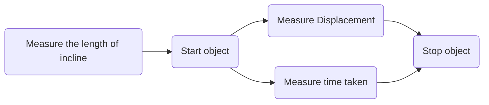

# Units 1-4 Progress Checks

**By: Ojasw Upadhyay** *Period 5*

## Unit 1 FRQ

### Question 1

#### Part A  

The relevant equation is:
$$
\begin{align}
\Delta x = v_0t + \dfrac12 at^2 \tag{1}
\end{align}
$$
#### Part B

1. Measure the length of the incline with the meterstick. 
2. Start the cylindrical object at rest  from the very top and a stopwatch at the same time. 
3. Measure the time that the object takes to traverse the incline.
4. Find the displacement of the object at small intervals of time.
5. Stop the object when the experiment is completed to prevent any damage to the object or anything or anyone else.

| Quantity to be Measured | Symbol for Quality | Equipment for Measurement |
| ----------------------- | ------------------ | ------------------------- |
| Initial velocity        | $v_0$              | N/A                       |
| Time                    | $t$                | Stopwatch                 |
| Displacement            | $\Delta x$         | Meterstick                |

#### Part C

(i)

**Vertical axis:** Velocity (Change in Displacement / Unit Time) (m/s)

**Horizontal axis:** Time (s) 

(ii)

The graph can be analyzed to find the acceleration by finding **the slope of the line** which would be the first derivative. The first derivative looks at the change in velocity per change in time or $\dfrac{dv}{dt}$. This is equal to $\dfrac{dv}{dt} = \dfrac{\left(\frac{dx}{dt}\right)}{dt} = \dfrac{dx}{dt^2}$ which has the units, $\mathrm{m/s^2}$, verifying our process.

#### Part D

(i)

The acceleration is to the **left** as the ball slows to a stop and reverses the direction of motion. 

(ii)

The magnitude of the acceleration when the ball bounces of the wall is **greater than** the acceleration when rolling down the ramp because of two reasons: magnitude and time. The magnitude in the change of the velocity is doubled as not only does the ball slow down to zero, but speed up in the reverse direction. Moreover, the acceleration occurs over a smaller time frame, which means the acceleration is greater as it is defined to be the change in velocity over the change in time.

### Question 2

#### Part A

(i)

Taking the upwards direction as positive:
$$
\Delta x = v_0t + \dfrac12 at^2 \Longrightarrow a = \dfrac{2\Delta x - 2v_0t}{t^2} = \boxed{-5\;\mathrm{m/s^2}}\tag{2}
$$
(ii)

$v_d > v_u$ because the initial velocity has an equivalent counterpart when the rock returns to the same elevation (100 meters above the Planet X’s surface) so as the rock travels further, it speeds up due to the acceleration as the magnitude of the velocity increases. 

#### Part B

**The Acceleration Due to Gravity** is a constant: $g = \boxed{-9.8\;\mathrm{m/s^2}}$, which is greater than Planet X’s. **The Time in Free Fall**: $\Delta y = v_0t + \dfrac12 at^2 \Longrightarrow 4.9t^2 - 15t-100 =0 \Longrightarrow t = \boxed{6.3\;\mathrm{s}}$, which is less than that on Planet X. **The Speed When It Reaches the Ground**: $v = v_0 + at = 15 + (-9.8)(6.3) = \boxed{-47\;\mathrm{m/s}}$, which is more than that on Planet X. **The Maximum Height** is $\Delta y_{\text{max}} = h + \dfrac{v_0^2}{2g} = 111.479591\approx \boxed{110\;\mathrm{m}}$, which is less than that on Planet X.

## Unit 2

### Question 1

#### Part A

(i)

The block has **an upwards normal force from the ground** and **a downwards gravitational force** with the upwards force’s magnitude greater than the gravitational force’s by x Newtons. Since this block is at rest, **the net downwards force from Block 2** is equal to x Newtons. Since this diagram is relative, we can say that x = 1 “unit,” the gravitational force = 2 “units” and the normal force from the ground = 3 “units.”

(ii)

Since all the blocks are are rest, there is no acceleration of the blocks. This means that due to F = ma on the pulley system, there is no tension force in the string. Hence, the only forces are an **upwards normal force from Block 1** with magnitude x and **a downwards gravitational force** of magnitude x.

#### Part B

(i)

When $m_3 > m_2$, then the motion of block 3 is much slower as there is a smaller proportion of the mass in free fall, which causes the acceleration as there is the unbalanced force of gravity. This was previously countered by the normal force from block 3 which has now been removed. **This unbalanced force causes Block 3 to start moving to the right.**

(ii)

We can consider the entire pulley system to be in a vertical reference. Considering the system as a whole box, the internal forces are not relevant so only external forces will accelerate the system.
$$
\begin{align}
\sum F_x = F_g - F_N = 0 \Longrightarrow \text{all acceleration is in the y direction} \\
\sum F_y = F_{G_2} = m_2g \\
a_{\text{system}} = \dfrac{\sum F}{m_{\text{total}}} = \boxed{g\left(\dfrac{m_2 }{m_2 + m_3}\right)} \tag{system acceleration}
\end{align}
$$

#### Part C

My answer to part (b)(ii) is **consistent** with my claim in part (b)(i) as it describes an acceleration towards the ground for Block 2 and a movement to the right for Block 1 as a pulley changes the direction of the force. Hence my claim was correct that the unbalanced force serves to accelerate the blocks.

#### Part D

Assuming again that the downwards direction is positive, **the acceleration is constant and positive** (horizontal line) and **the velocity increases at a constant (linear) fashion** from left to right.

### Question 2

#### Part A

(i)

The **first dot has a net force towards the left** and the **second dot has a net force to the right** as they collide.

(ii)

The center of mass which represents the entire system does not change its velocity based on forces that occur within the system. So the center of mass is **staying the same** due to the conservation of energy within a conservative system.

#### Part B

The axes are parallel and perpendicular to the slope. 

(i)

The net force on the system is $mg\sin\theta = 2.4\;\mathrm{N}$ due to gravity.

(ii)

The change in velocity can be calculated through $F = ma$ and $v = v_0 + at$
$$
\begin{align}
v_f &= v_0 + at \tag{kinematic equation}\\
v_f &= 0 + \dfrac{mg\sin\theta}{m_{\text{total}}} \cdot t = \left(\dfrac{2.4}{0.4}\right)\cdot 0.5 = \boxed{3\;\mathrm{m/s}} \tag{final velocity}
\end{align}
$$

## Unit 3

### Question 1

#### Part A

(i)

Force of gravity straight down. Tension force in the direction of the string ( up and to the left ).

(ii)
$$
\begin{align}
\sum F_y &= F_T\cos\theta - Mg = 0 \\ F_T &= \dfrac{Mg}{\cos\theta} \\
\sum F_x &= Ma_c = F_T\sin\theta \\ \dfrac{Mg\sin\theta}{\cos\theta} &= Mg \tan\theta \\
a_c  &= \boxed{g\tan\theta}
\end{align}
$$

#### Part B

(i)

$g = \dfrac{a_c}{\tan\theta} = \dfrac{mv^2}{r \tan\theta} = \dfrac{m\left(\dfrac{2\pi r}{T}\right)^2}{r \tan\theta} \tag{1}$

Hence, 

| Quantity to be Measured | Symbol for Quantity | Equipment for Measurement |
| ----------------------- | ------------------- | ------------------------- |
| Radius                  | $r$                 | meterstick                |
| Period                  | $T$                 | stopwatch                 |
| Mass                    | $m$                 | triple beam balance       |
| Length                  | $L$                 | meterstick                |

(ii)

| #    | Procedure                                                    | Equipment              | Quantity Solved For |
| ---- | ------------------------------------------------------------ | ---------------------- | ------------------- |
| 1    | Measure the mass of the block and the length of the string. Use three trials to reduce error in the measurement. | Meterstick + Balance   | $m$ and $L$         |
| 2    | Start the motor to start the conical pendulum.               | Motor + String + Block | N/A                 |
| 3    | Measure the radius of the traveling block. Use three trials again. | Meterstick             | $r$                 |
| 4    | Start and stop the stopwatch to measure the period of the block’s motion. Use three trials. | Stopwatch              | $T$                 |
| 6    | Calculate the angle with the equality $\sin\theta = \dfrac{r}{L}$ by solving for theta. | Calculator             | $\theta$            |
| 7    | Now, plug in the values for $m$, $r$,  $T$, and $\theta$ to solve for $g$. | Calculator             | $g$                 |

#### Part C

$g =\dfrac{m\left(\dfrac{2\pi r}{T}\right)^2}{r \tan\theta} = \dfrac{4\pi^2mr}{T^2 \cdot\tan\theta } \Longrightarrow \dfrac{g}{4\pi^2} =  \dfrac{mL\cos\theta}{T^2} = \dfrac{m\ell}{T^2} \tag{2}$

(i)

Keeping the mass of the block constant, the horizontal axis is period squared and the vertical axis is length.

(ii)

The slope of the graph is shown in equation 2 to be $\dfrac{g}{4\pi^2}$, so the slope would be multiplied by $4\pi^2$ to determine $g$.

### Question 2

#### Part A

$4F_0$ for both

#### Part B

$$
\begin{align*}
\sum F_{\text{inwards}} &= F_g = m_{\text{satellite}} \cdot a_c \\
\dfrac{m_{\text{satellite}}\cdot v_t^2}{r} &= \dfrac{G\cdot m_S\cdot m_{\text{satellite}}}{r^2} \\
v_t &= \boxed{\sqrt{\dfrac{G\cdot m_S}{r}}}
\end{align*} \\
$$

With this derivation, the only factors in the speed of a satellite in orbit are the radius of the orbit from the center of mass and the mass of the star or planet that is in the “center.” Since both System A and B have stars of equal mass $M_S$, the tangential speed of Planet B is the same as that of Planet A. However, since System C has a star of mass $4M_S$, the tangential velocity of Planet C is greater than (twice) that of Planet A. 

## Unit 4

### Question 1

#### Part A

(i)

Student 1 is correct that rocket Y is launched with the same speed and has more kinetic energy as stated in the problem and $\dfrac12 M_R v_0^2 > \dfrac12 m_R v_0^2$, respectively. 

(ii)

The student is incorrect about the maximum vertical displacement and the time it takes to reach the ground. The maximum vertical displacement of Rocket Y is the same as $h = \dfrac{v^2}{2g}$, which is mass independent. Since the max height is the same, the time will be the same as both have the same acceleration due to gravity. 

(iii)

Student 2 is correct that the maximum vertical displacement of Rocket Y is the same as $h = \dfrac{v^2}{2g}$, which is mass independent. Since the max height is the same, the student also is correct that the time will be the same as both have the same acceleration due to gravity. 

(iv)

Student 2 is incorrect about the kinetic energy.  Rocket Y is launched with more kinetic energy as $\dfrac12 M_R v_0^2 > \dfrac12 m_R v_0^2$. 

#### Part B

Both reach the same height.
$$
\begin{align}
mgh_{\text{max}} = PE &= KE = \dfrac12 mv_0^2 \\
gh_{\text{max}} &= \dfrac12 v_0^2 \\
h_{\text{max}} &= \boxed{\dfrac{v_0^2}{2g}}
\end{align}
$$

#### Part C

$$
\begin{align}
\Delta y &= vt + \dfrac12 gt^2 \\ 
-H_X = -H_Y &= \dfrac12 gt^2 \\
\dfrac{-2H_X}{g} = \dfrac{-2H_Y}{g} &= t^2 \\
\boxed{\sqrt{\dfrac{-2H_X}{g}} = \sqrt{\dfrac{-2H_Y}{g}}} &= t \\
\end{align}
$$

#### Part D

(i)

In Student 2’s response, the student accurately showed how if the initial velocities remained equal between the rockets, then the maximum vertical displacement would also be equal. This is shown in my equation which is mass independent and only need v_0 to be equal to have the maximum heights be equal. 

(ii)

Student 2 is also correct that “[s]ince both rockets have the same maximum vertical displacement… both rockets [take] the same amount of time to reach the ground.” This is shown in my equation as both values of t would be equal if the maximum heights were equal.

### Question 2

#### Part A

(i)

The KE from the initial jump is quickly converted to more PE as it moves higher. Then all of the PE of the person is converted to KE as the person falls towards the earth. 

(ii)
$$
PE_S = \dfrac12 kx^2 = \dfrac12 k\left((D-H)-L\right) = mgD + \dfrac12mv_0^2  = PE_0 + KE_0 \\
k = \boxed{\dfrac{2mgD + mv_0^2}{D-H-L}}
$$

#### Part B

The stretch length of the cord in the case with air resistance is **less than** the stretch length on the case in which air resistance is ignored as some of the kinetic energy (from the original potential) is lost to air resistance which is a nonconservative force and results in “energy loss” as the energy is converted to an unusable form (heat). 