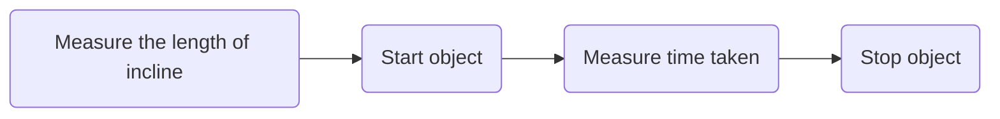

# Units 1-4 Progress Checks

## Unit 1 FRQ

### Question 1

#### Part A  

The relevant equation is:
$$
\begin{align}
\Delta x = v_0t + \dfrac12 at^2 \tag{1}
\end{align}
$$
#### Part B

1. Measure the length of the incline with the meterstick. 
2. Start the cylindrical object at rest  from the very top and a stopwatch at the same time. 
3. Measure the time that the object takes to traverse the incline.
4. Find the displacement of the object at small intervals of time.
5. Stop the object when the experiment is completed to prevent any damage to the object or anything or anyone else.

| Quantity to be Measured | Symbol for Quality | Equipment for Measurement |
| ----------------------- | ------------------ | ------------------------- |
| Initial velocity        | $v_0$              | N/A                       |
| Time                    | $t$                | Stopwatch                 |
| Displacement            | $\Delta x$         | Meterstick                |

#### Part C

(i)

**Vertical axis:** Velocity (Change in Displacement / Unit Time) (m/s)

**Horizontal axis:** Time (s)

(ii)

The graph can be analyzed to find the acceleration by finding **the slope of the line** which would be the first derivative. The first derivative looks at the change in velocity per change in time or $\dfrac{dv}{dt}$. This is equal to $\dfrac{dv}{dt} = \dfrac{\left(\frac{dx}{dt}\right)}{dt} = \dfrac{dx}{dt^2}$ which has the units, $\mathrm{m/s^2}$, verifying our process.

#### Part D

(i)

The acceleration is to the **left** as the ball slows to a stop and reverses the direction of motion. 

(ii)

The magnitude of the acceleration when the ball bounces of the wall is **greater than** the acceleration when rolling down the ramp because of two reasons: magnitude and time. The magnitude in the change of the velocity is doubled as not only does the ball slow down to zero, but speed up in the reverse direction. Moreover, the acceleration occurs over a smaller time frame, which means the acceleration is greater as it is defined to be the change in velocity over the change in time.

### Question 2

#### Part A

(i)

Taking the upwards direction as positive:
$$
\Delta x = v_0t + \dfrac12 at^2 \Longrightarrow a = \dfrac{2\Delta x - 2v_0t}{t^2} = \boxed{-5\;\mathrm{m/s^2}}\tag{2}
$$
(ii)

$v_d > v_u$ because the initial velocity has an equivalent counterpart when the rock returns to the same elevation (100 meters above the Planet X’s surface) so as the rock travels further, it speeds up due to the acceleration as the magnitude of the velocity increases. 

#### Part B

**Acceleration Due to Gravity**: $g = \boxed{-9.8\;\mathrm{m/s^2}}$

**Time in Free Fall**: $\Delta y = v_0t + \dfrac12 at^2 \Longrightarrow 4.9t^2 - 15t-100 =0 \Longrightarrow t = \boxed{6.3\;\mathrm{s}}$

**Speed When It Reaches the Ground**: $v = v_0 + at = 15 + (-9.8)(6.3) = \boxed{-47\;\mathrm{m/s}}$

**Maximum Height**:
$$
\Delta y_{\text{max}} = h + \dfrac{v_0^2}{2g} = 111.479591\approx \boxed{110\;\mathrm{m}}
$$
With all of this, we can see that though the initial height and the initial height are the same, the great acceleration due to gravity on earth reduces the maximum height, increases its speed when it reaches the ground, and decreases the time in free fall.

## Unit 2

